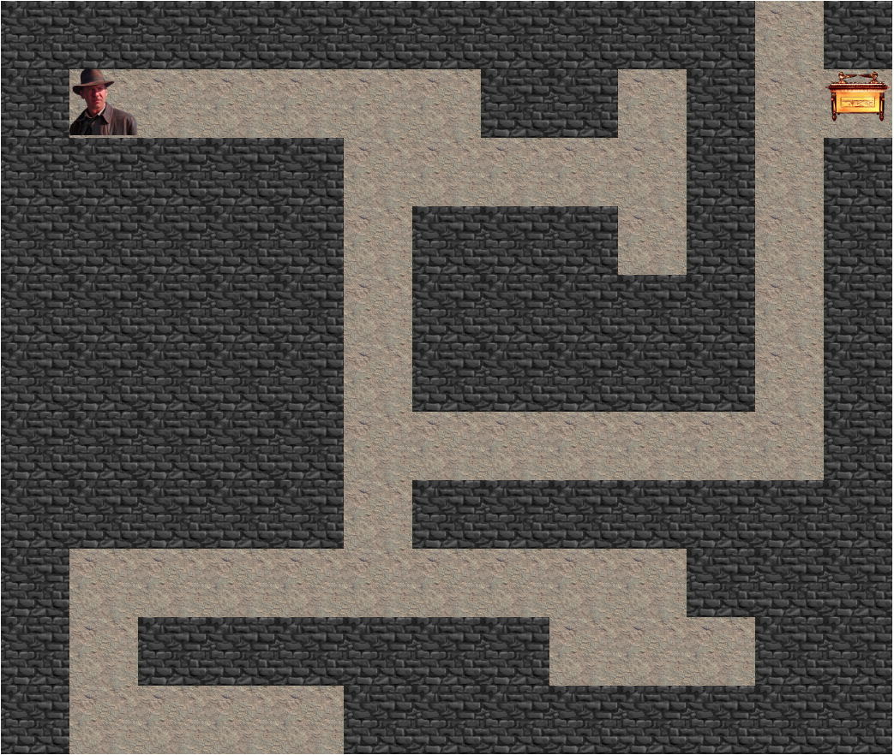

# aMAZEing maze

This project was made by [Aurore Van Hoorebeke](https://github.com/AuroreVanHoorebeke).  
It was finished on the 25th of November 2020, during my junior webdev training at BeCode.    
## What is it exactly?
In order to learn more about JavaScript, we were asked to create a a simple maze game.  
We were given a pattern and were asked to move and get out of the maze.
## Language

- JavaScript

## What have I learned?
I learned how to use event listeners to move a character with the keyboard's arrows.  
I used a 2d array as well to store the pattern and generate the maze.  

## The main challenge  
It took me a big amount of time to change how I was drawing the board. I started with a simple array and then moved to a 2D array. 

## Things I wanted to add  
There are many ideas I didn"t have time to add to this project:  
- A theme selector, to change the maze's theme. Indiana Jones is awesome, but choosing another theme for the maze is even better!
- A timer to know how long it took to solve the maze.
- A score counter.
- Change levels automatically.
- A sort of menu before and after the game.

## Appearance  
  
Here's what it looks like!  
-> [Online demo](https://aurorevanhoorebeke.github.io/amazeing/) <-  